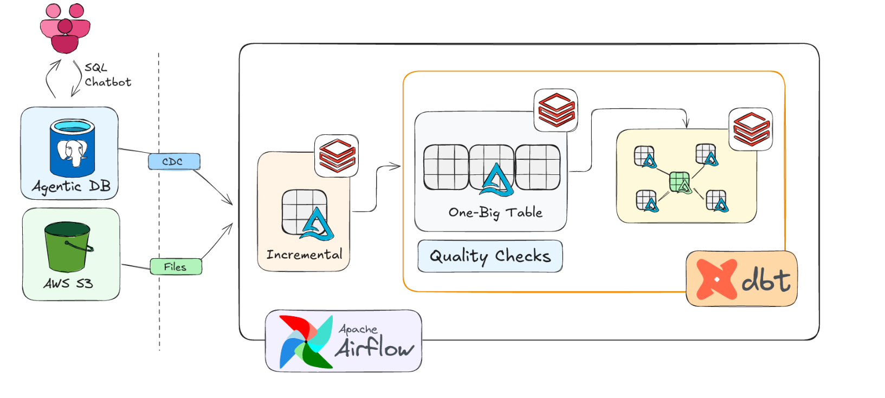

# Walmart Data Engineering End-to-End Project

**Apache Airflow + dbt + Databricks + Delta Lake + AWS S3**



This repository implements the **Airflow + dbt + Databricks** portion of an end-to-end Walmart data engineering project based on the architecture demonstrated in the reference tutorial.

The pipeline is designed around two ingestion paths:

- **Agentic DB → CDC → Databricks**
- **AWS S3 → Files → Databricks**

The uploaded project repository contains the **Airflow orchestration, Docker environment, dbt project, transformations, tests, snapshots, and Databricks job trigger**. The Databricks ingestion job itself is external to this repository and is triggered from Airflow through the Databricks SDK.

---

## Table of Contents

- [Project Overview](#project-overview)
- [Architecture](#architecture)
- [How the Architecture Maps to This Repository](#how-the-architecture-maps-to-this-repository)
- [End-to-End Data Flow](#end-to-end-data-flow)
- [Source Layer](#source-layer)
- [CDC and Databricks Job](#cdc-and-databricks-job)
- [Incremental Processing](#incremental-processing)
- [Apache Airflow Orchestration](#apache-airflow-orchestration)
- [dbt Transformation Layer](#dbt-transformation-layer)
- [Silver Technical Layer](#silver-technical-layer)
- [Silver Business Layer and OBT](#silver-business-layer-and-obt)
- [Gold Ephemeral Models](#gold-ephemeral-models)
- [Snapshots and SCD Type 2](#snapshots-and-scd-type-2)
- [Gold Fact Model](#gold-fact-model)
- [Data Quality](#data-quality)
- [Databricks and Delta Lake](#databricks-and-delta-lake)
- [Dockerized Airflow Environment](#dockerized-airflow-environment)
- [Project Structure](#project-structure)
- [Technology Stack](#technology-stack)
- [Pipeline DAG](#pipeline-dag)
- [Configuration](#configuration)
- [Running the Project](#running-the-project)
- [Security Notes](#security-notes)
- [What This Project Demonstrates](#what-this-project-demonstrates)
- [Author](#author)

---

# Project Overview

The project demonstrates an end-to-end analytical data pipeline for Walmart-style retail data.

The source entities represented in the dbt project are:

- Customers
- Employees
- Orders
- Order Items
- Products
- Stores

The high-level architecture is:

```text
                    ┌──────────────────────┐
                    │      Agentic DB      │
                    │   Operational Data   │
                    └──────────┬───────────┘
                               │
                              CDC
                               │
                               ▼
                    ┌──────────────────────┐
                    │      Databricks      │
                    │   Ingestion / Bronze │
                    └──────────┬───────────┘
                               │
                               │
AWS S3 ─────────── Files ──────┤
                               │
                               ▼
                    ┌──────────────────────┐
                    │ Incremental / Bronze │
                    │       Data           │
                    └──────────┬───────────┘
                               │
                               ▼
                    ┌──────────────────────┐
                    │    Apache Airflow    │
                    │     Orchestration    │
                    └──────────┬───────────┘
                               │
                               ▼
                    ┌──────────────────────┐
                    │         dbt          │
                    │ Transform + Validate │
                    └──────────┬───────────┘
                               │
                ┌──────────────┴──────────────┐
                ▼                             ▼
       Silver Technical              Silver Business
                │                             │
                │                             ▼
                │                            OBT
                │                             │
                └──────────────┬──────────────┘
                               ▼
                       Gold Ephemeral
                               │
                               ▼
                         dbt Snapshots
                               │
                               ▼
                         Gold Dimensions
                               │
                               ▼
                          Gold Facts
```

---

# Architecture

The architecture image used by this repository is the project architecture diagram:


## Main architectural responsibilities

| Component | Responsibility |
|---|---|
| Agentic DB | Operational/source database |
| CDC | Captures database changes for downstream ingestion |
| AWS S3 | File-based source/landing path |
| Databricks | Ingestion and data processing platform |
| Incremental layer | Processes new/changed data rather than rebuilding everything unnecessarily |
| Apache Airflow | Orchestrates the end-to-end workflow |
| dbt | SQL transformation, testing, snapshots and model dependency management |
| Silver Technical | Cleaned/transformed source entities |
| Silver Business | Joined business representation / OBT |
| Gold Ephemeral | Intermediate dimension-oriented datasets |
| Gold Snapshots | Historical dimension tracking |
| Gold Fact | Analytical fact model |

---

# How the Architecture Maps to This Repository

There is an important distinction between the **complete architecture** and the files contained in this GitHub repository.

The repository contains:

```text
Airflow
    │
    ├── DAG
    ├── Databricks job trigger
    └── dbt orchestration
             │
             ▼
          dbt Core
             │
             ├── Silver Technical
             ├── Silver Business
             ├── Gold Ephemeral
             ├── Snapshots
             └── Gold Fact
```

The Databricks ingestion job is **referenced and triggered by Airflow**, but its notebook/job source is not included in the uploaded repository.

This is visible in `dags/orchestrate.py`, where the DAG uses the Databricks SDK to call an existing Databricks job.

Therefore, this repository should not claim that the Databricks ingestion notebook itself is stored here.

---

# End-to-End Data Flow

The complete logical flow is:

```text
1. Source data
       │
       ├── Agentic DB
       │
       └── AWS S3 files
              │
              ▼
2. Databricks ingestion
       │
       ▼
3. Bronze / incremental source data
       │
       ▼
4. Airflow starts the downstream workflow
       │
       ▼
5. dbt source freshness
       │
       ▼
6. Silver Technical models
       │
       ▼
7. Silver Technical tests
       │
       ▼
8. Silver Business OBT
       │
       ▼
9. Silver Business tests
       │
       ▼
10. Gold Ephemeral models
       │
       ▼
11. dbt snapshots
       │
       ▼
12. Gold fact model
```

---

# Source Layer

The dbt source configuration is located at:

```text
walmart_data_engineer/models/source/sources.yml
```

The configured Databricks source is:

```text
catalog/database: walmart
schema:            bronze
source:            walmart_databricks
```

The source tables are:

```text
walmart.bronze.orders
walmart.bronze.customers
walmart.bronze.products
walmart.bronze.order_items
walmart.bronze.stores
walmart.bronze.employees
```

These source definitions allow dbt to reference upstream data and perform source freshness checks.

---

# CDC and Databricks Job

The Airflow DAG contains a task named:

```text
ingest_cdc
```

This task creates a Databricks `WorkspaceClient`, triggers an existing Databricks job with `run_now`, and waits for the Databricks run to finish.

The implementation checks Databricks run states and only continues when the job reports success.

Conceptually:

```text
Airflow
   │
   ▼
ingest_cdc
   │
   ▼
Databricks Jobs API
   │
   ▼
Existing Databricks Job
   │
   ▼
CDC / ingestion processing
   │
   ▼
Success
   │
   ▼
Continue Airflow DAG
```

The DAG polls the Databricks job until it reaches a terminal state.

If the job succeeds, the pipeline continues.

If the job fails, the Airflow task raises an exception.

### Important repository boundary

The actual Databricks job definition is **not included in this repository**. Only its Airflow trigger is included.

---

# Incremental Processing

The architecture includes an incremental processing stage between ingestion and downstream transformations.

The purpose of incremental processing is to avoid unnecessarily rebuilding all data when only new or changed records need to be processed.

The repository's dbt models also use Databricks-generated incremental/merge behavior in the executed artifacts.

The general concept is:

```text
Existing Data
     +
New / Changed Data
     │
     ▼
Incremental Processing
     │
     ▼
Updated Dataset
```

The exact CDC ingestion implementation lives in the external Databricks job referenced by the Airflow DAG.

---

# Apache Airflow Orchestration

Apache Airflow is responsible for controlling the order of operations.

The DAG is defined in:

```text
dags/orchestrate.py
```

The DAG is named:

```text
orchestrate
```

The task dependency chain implemented in the repository is:

```text
ingest_cdc
    ↓
clean_target
    ↓
source_freshness
    ↓
silver_technical
    ↓
silver_technical_tests
    ↓
silver_business
    ↓
silver_business_tests
    ↓
gold_ephermeral
    ↓
gold_dimensions
    ↓
gold_facts
```

The spelling `gold_ephermeral` is the current task ID in the uploaded code.

---

## Airflow Task Details

### 1. `ingest_cdc`

Triggers the configured Databricks job and waits for completion.

### 2. `clean_target`

Removes the local dbt:

```text
target/
logs/
```

directories before the dbt workflow starts.

### 3. `source_freshness`

Runs:

```bash
dbt source freshness
```

### 4. `silver_technical`

Runs:

```bash
dbt run --select silver_t
```

### 5. `silver_technical_tests`

Runs:

```bash
dbt test --select silver_t
```

### 6. `silver_business`

Runs:

```bash
dbt run --select silver_b
```

### 7. `silver_business_tests`

Runs:

```bash
dbt test --select silver_b
```

### 8. `gold_ephermeral`

Runs the Gold ephemeral model selection.

The current repository command is:

```bash
dbt run --select gold/ephermeral
```

### 9. `gold_dimensions`

Runs:

```bash
dbt snapshot
```

This creates/updates the snapshot-based dimension tables.

### 10. `gold_facts`

Runs:

```bash
dbt run --select gold/fact
```

This builds the final fact model.

---

# dbt Transformation Layer

The dbt project is located at:

```text
walmart_data_engineer/
```

The dbt project is configured as:

```yaml
name: walmart_project
version: 1.0.0
profile: walmart_project
```

The main dbt paths are:

```text
models/
tests/
snapshots/
macros/
seeds/
analyses/
```

The project creates three major transformation areas:

```text
silver_t
silver_b
gold
```

---

# Silver Technical Layer

The Silver Technical layer is located at:

```text
models/silver_t/
```

It contains:

```text
customers_t.sql
employees_t.sql
orders_t.sql
order_items_t.sql
products_t.sql
stores_t.sql
properties.yml
```

The models transform the corresponding Bronze source tables.

Conceptually:

```text
walmart.bronze.customers
             │
             ▼
       customers_t

walmart.bronze.orders
             │
             ▼
         orders_t

walmart.bronze.products
             │
             ▼
        products_t
```

The same pattern is applied to:

- employees
- order items
- stores

The dbt project configures these models as tables in the `silver_t` schema.

---

# Silver Business Layer and OBT

The Silver Business layer is located at:

```text
models/silver_b/obt_b.sql
```

The main model is:

```text
obt_b
```

The OBT combines data from the Silver Technical models.

The joins implemented in the SQL include:

```text
orders_t
    │
    ├── customers_t
    │
    ├── order_items_t
    │
    └── stores_t
           │
           └── employees_t

order_items_t
    │
    └── products_t
```

The resulting dataset combines order, customer, order-item, product, employee and store attributes.

### Why OBT?

The OBT provides a consolidated business-level dataset that can be reused by downstream Gold models instead of repeating the same joins.

---

# Gold Ephemeral Models

The Gold ephemeral models are located at:

```text
models/gold/ephemeral/
```

The repository contains:

```text
eph_customers.sql
eph_employees.sql
eph_orders.sql
eph_products.sql
eph_stores.sql
```

Each model selects a distinct dimension-oriented representation from:

```text
obt_b
```

For example:

```text
obt_b
  │
  ├── eph_customers
  ├── eph_employees
  ├── eph_orders
  ├── eph_products
  └── eph_stores
```

The dbt project explicitly configures this directory as:

```yaml
ephemeral:
  +materialized: ephemeral
```

Therefore these models are used as intermediate dbt relations rather than being persisted as standalone physical tables.

---

# Snapshots and SCD Type 2

The repository contains five snapshot definitions:

```text
snapshots/
├── dim_customers.yml
├── dim_employees.yml
├── dim_orders.yml
├── dim_products.yml
└── dim_stores.yml
```

These snapshots use the corresponding ephemeral models as their relations.

For example:

```text
eph_customers
      │
      ▼
dim_customers snapshot
```

The snapshot configuration uses:

```text
strategy: timestamp
```

and tracks changes using the relevant:

```text
updated_timestamp
```

column.

The snapshot configuration also defines a current-record date using:

```text
9999-12-31
```

for `dbt_valid_to`.

This allows historical versions of dimension records to be retained.

Conceptually:

```text
Customer ID
    │
    ├── Version 1
    │     dbt_valid_from
    │     dbt_valid_to
    │
    └── Version 2
          dbt_valid_from
          dbt_valid_to
```

This is the project's implementation of a **Slowly Changing Dimension Type 2-style historical pattern**.

---

# Gold Fact Model

The fact model is:

```text
models/gold/fact/fact_orders.sql
```

The resulting model is:

```text
fact_orders
```

It is built from:

```sql
{{ ref('obt_b') }}
```

The selected fields include:

```text
order_id
order_item_id
product_id
store_id
employee_id
customer_id
total_amount
quantity
unit_price
line_amount
```

The fact table therefore represents order/order-item level business activity with links to the major business entities.

---

# Data Quality

The project implements data quality at multiple stages.

## Source Freshness

Airflow runs:

```bash
dbt source freshness
```

before the Silver Technical models.

This checks the freshness of configured dbt sources.

---

## Silver Technical Tests

The project contains dbt tests for:

### Products

```text
product_id
    ├── not_null
    └── unique
```

The product tests also use a configuration condition:

```text
price > 0
```

### Orders

```text
order_id
    ├── not_null
    └── unique
```

---

## Silver Business Test

The project contains a singular SQL test:

```text
tests/test_obt.sql
```

The test checks whether important OBT identifiers are null:

```text
order_id
product_id
employee_id
store_id
order_item_id
customer_id
```

The test is configured with:

```text
severity = warn
```

This means the test is treated as a warning rather than an error.

---

# Databricks and Delta Lake

Databricks is the processing platform used by the project.

The dbt profile connects to a Databricks SQL endpoint using:

```text
type: databricks
catalog: walmart
schema: dbt_schema
host: <Databricks host>
http_path: <HTTP path>
token: <token>
```

The dbt source points to:

```text
walmart.bronze
```

while transformed datasets are configured into:

```text
walmart.silver_t
walmart.silver_b
walmart.gold
```

The executed dbt artifacts in the uploaded project show Databricks SQL `MERGE` operations for transformed models and snapshot processing.

Delta Lake is part of the Databricks data platform used by the architecture. The actual Delta ingestion/table creation logic belongs to the Databricks job that is triggered by Airflow and is not included in this repository.

---

# Dockerized Airflow Environment

The repository uses Docker Compose for the Airflow environment.

The custom image is defined by:

```text
Dockerfile
```

The Dockerfile starts from:

```text
apache/airflow:3.2.2
```

and installs the project's additional Python dependencies.

The Docker Compose configuration uses:

```text
CeleryExecutor
```

and includes the main Airflow services plus supporting infrastructure.

### Main components

```text
Airflow API Server
Airflow Scheduler
Airflow DAG Processor
Airflow Worker
Airflow Triggerer
Airflow Init
Airflow CLI
```

### Supporting services

```text
PostgreSQL
Redis
Flower
```

PostgreSQL is used as the Airflow metadata/result database and Redis is used as the Celery broker.

This repository's Docker Compose file is explicitly intended for **local development**, not a production deployment.

---

# Project Structure

The relevant source-controlled structure is:

```text
airflow_dbt_project/
│
├── Dockerfile
├── docker-compose.yaml
├── requirements.txt
│
├── dags/
│   └── orchestrate.py
│
├── config/
│   └── airflow.cfg
│
├── plugins/
│
└── walmart_data_engineer/
    │
    ├── dbt_project.yml
    ├── profiles.yml
    │
    ├── models/
    │   ├── source/
    │   │   └── sources.yml
    │   │
    │   ├── silver_t/
    │   │   ├── customers_t.sql
    │   │   ├── employees_t.sql
    │   │   ├── orders_t.sql
    │   │   ├── order_items_t.sql
    │   │   ├── products_t.sql
    │   │   ├── stores_t.sql
    │   │   └── properties.yml
    │   │
    │   ├── silver_b/
    │   │   └── obt_b.sql
    │   │
    │   └── gold/
    │       ├── ephemeral/
    │       │   ├── eph_customers.sql
    │       │   ├── eph_employees.sql
    │       │   ├── eph_orders.sql
    │       │   ├── eph_products.sql
    │       │   └── eph_stores.sql
    │       │
    │       └── fact/
    │           └── fact_orders.sql
    │
    ├── snapshots/
    │   ├── dim_customers.yml
    │   ├── dim_employees.yml
    │   ├── dim_orders.yml
    │   ├── dim_products.yml
    │   └── dim_stores.yml
    │
    ├── tests/
    │   └── test_obt.sql
    │
    ├── macros/
    │   └── custom_schema.sql
    │
    ├── seeds/
    ├── analyses/
    └── .gitignore
```

### Files that should not be committed

The uploaded ZIP currently contains generated/runtime artifacts such as:

```text
logs/
target/
dbt_packages/
__pycache__/
.env
```

These should be excluded from the final Git repository.

The real GitHub repository should keep the source code and configuration templates, not generated execution artifacts or secrets.

---

# Technology Stack

| Technology | Role in this project |
|---|---|
| Apache Airflow | Workflow orchestration |
| dbt Core | SQL transformation, tests and snapshots |
| dbt-databricks | dbt adapter for Databricks |
| Databricks | Data processing and analytical platform |
| Delta Lake | Databricks lakehouse storage layer |
| AWS S3 | File-based ingestion path in the architecture |
| PostgreSQL | Airflow metadata database |
| Redis | Celery broker |
| Docker | Local Airflow environment |
| Python | Airflow DAG and Databricks SDK integration |
| SQL / Jinja | dbt transformations |
| Git | Version control |

---

# Pipeline DAG

The actual Airflow dependency chain is:

```text
┌──────────────┐
│  ingest_cdc  │
└──────┬───────┘
       ▼
┌──────────────┐
│ clean_target │
└──────┬───────┘
       ▼
┌──────────────────┐
│ source_freshness │
└────────┬─────────┘
         ▼
┌───────────────────┐
│ silver_technical  │
└─────────┬─────────┘
          ▼
┌──────────────────────────┐
│ silver_technical_tests   │
└───────────┬──────────────┘
            ▼
┌───────────────────┐
│  silver_business  │
└─────────┬─────────┘
          ▼
┌─────────────────────────┐
│ silver_business_tests  │
└──────────┬──────────────┘
           ▼
┌──────────────────┐
│ gold_ephermeral  │
└────────┬─────────┘
         ▼
┌──────────────────┐
│ gold_dimensions  │
│  dbt snapshot    │
└────────┬─────────┘
         ▼
┌──────────────────┐
│    gold_facts    │
└──────────────────┘
```

This dependency chain is explicitly defined in `dags/orchestrate.py`.

---

# Configuration

## Airflow

Airflow is configured through:

```text
docker-compose.yaml
.env
config/airflow.cfg
```

## dbt

The dbt project uses:

```text
dbt_project.yml
profiles.yml
```

The profile connects to Databricks.

### Required Databricks information

You need:

```text
Databricks host
Databricks HTTP path
Databricks token
Databricks job ID
```

The Airflow DAG uses the host, token and job ID to trigger the Databricks ingestion job.

---

# Running the Project

## Prerequisites

Install:

- Docker Desktop
- Git
- Access to a Databricks workspace
- Access to the required Databricks SQL endpoint
- Access to the source/bronze data
- The Databricks ingestion job referenced by the Airflow DAG

---

## 1. Configure secrets

Create a local `.env` file.

Do not commit it.

The Airflow Compose file expects values such as:

```text
AIRFLOW_UID
FERNET_KEY
```

The Databricks values are also required by the DAG/dbt profile.

---

## 2. Configure the Databricks connection values

Replace the placeholders in your local configuration:

```text
your_databricks_host
your_databricks_token
your_job_id
your_http_path
```

with your actual values.

---

## 3. Build the Airflow image

```bash
docker compose build
```

---

## 4. Start the environment

```bash
docker compose up -d
```

Check services:

```bash
docker compose ps
```

---

## 5. Open Airflow

The Compose configuration exposes the Airflow API server on:

```text
http://localhost:8080
```

Enable the `orchestrate` DAG and trigger it manually.

---

## 6. Monitor the pipeline

Follow the DAG:

```text
ingest_cdc
→ clean_target
→ source_freshness
→ silver_technical
→ silver_technical_tests
→ silver_business
→ silver_business_tests
→ gold_ephermeral
→ gold_dimensions
→ gold_facts
```

Airflow task logs can be used to diagnose failures.

---

# Running dbt Manually

The dbt project directory is:

```text
walmart_data_engineer/
```

Useful commands include:

```bash
dbt debug
```

```bash
dbt source freshness
```

```bash
dbt run --select silver_t
```

```bash
dbt test --select silver_t
```

```bash
dbt run --select silver_b
```

```bash
dbt test --select silver_b
```

```bash
dbt snapshot
```

```bash
dbt run --select gold/fact
```

The normal project execution should be performed through the Airflow DAG so that the intended task dependencies are respected.

---

# Security Notes

The uploaded project contains placeholder credentials in the DAG and dbt profile.

For GitHub, do **not** commit real credentials.

Use:

```text
.env.example
```

for documenting required environment variables and keep:

```text
.env
```

out of version control.

For a more production-oriented implementation, credentials should be stored using Airflow Connections, environment variables, or a dedicated secret manager rather than hardcoded in source code.

---

# What This Project Demonstrates

This project demonstrates practical knowledge of:

### Airflow

- DAG creation
- Task dependencies
- BashOperator
- TaskFlow API
- Databricks job triggering
- External job monitoring
- Local Docker-based Airflow deployment

### dbt

- Sources
- Source freshness
- Model organization
- `ref()`
- Jinja
- Tests
- Singular SQL tests
- Ephemeral models
- Snapshots
- SCD Type 2-style historical tracking
- Model schemas
- Databricks adapter

### Databricks

- Databricks job integration
- Databricks SQL
- Bronze/Silver/Gold organization
- Incremental data processing
- Delta Lake-oriented lakehouse architecture

### Data Modeling

- Source-to-Silver transformation
- Business OBT
- Dimension-oriented intermediate models
- Snapshot-based dimensions
- Fact modeling
- Historical data tracking

### Data Quality

- Source freshness checks
- `not_null`
- `unique`
- Conditional test configuration
- Singular SQL test
- Warning-level data quality validation

### Docker

- Custom Airflow image
- Docker Compose
- CeleryExecutor
- PostgreSQL
- Redis
- Local orchestration environment

---

# Limitations of This Repository

For accuracy, the following distinction is important.

### Included

This repository contains:

- Airflow DAG
- Airflow Docker environment
- dbt project
- dbt source definitions
- Silver Technical models
- Silver Business OBT
- Gold ephemeral models
- Gold fact model
- dbt snapshots
- dbt tests
- Databricks SDK integration

### Not Included

The uploaded repository does not contain the actual Databricks ingestion notebook/job implementation for the CDC/file ingestion layer.

The Airflow DAG instead triggers an already-created Databricks job using:

```python
ws.jobs.run_now(job_id="your_job_id")
```

Therefore the README describes the ingestion architecture shown in the project diagram/video while clearly separating it from the code that is actually present in this repository.

---

# Author

**Aayush Kumar**

Data Engineering  
Python • SQL • Apache Airflow • dbt • Databricks • Delta Lake • AWS
